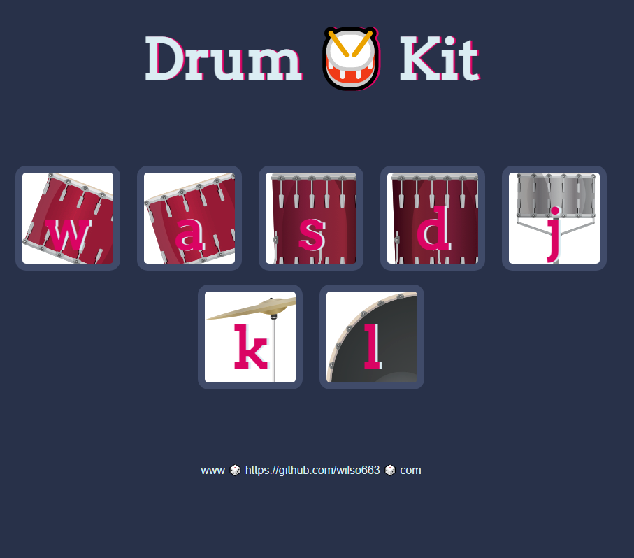

# Angela Yu Web Development Course - Dicee Javascript Challenge solution

This is a solution to the [Drum Kit Javascript exercise chapter by Angela Yu](https://www.udemy.com/course/the-complete-web-development-bootcamp). 

## Table of contents

- [Overview](#overview)
  - [The challenge](#the-challenge)
  - [Screenshot](#screenshot)
  - [Links](#links)
- [My process](#my-process)
  - [Built with](#built-with)
  - [What I learned](#what-i-learned)
  - [Continued development](#continued-development)
  - [Useful resources](#useful-resources)
- [Author](#author)

## Overview

### The challenge

Users should be able to:
- Click or press the key listed in the images on screen to play the corresponding drum sound
- View the optimal layout depending on their device's screen size

### Screenshot




### Links

- Solution URL: [https://github.com/wilso663/drum-kit-challenge](https://github.com/wilso663/drum-kit-challenge)
- Live Site URL: [https://festive-ride-812509.netlify.app/](https://festive-ride-812509.netlify.app/)

## My process

### Built with

- CSS 3, Vanilla JS
- Desktop-first workflow

### What I learned

The most helpful thing that I learned was using es6 to be able to reference objects passed as parameters without the vanilla JS 'this' keyword:
```javascript
  document.querySelectorAll(".drum").forEach(item => {
  item.addEventListener('click', event => {
    var buttonInnerHTML = item.innerHTML;
  });
});
```
Attempting to reference the current object with loop iteration without the use of the function parameter reference 'item', but using the 'this' keyword directly instead would have caused a null reference error. This is a great quality of life improve for javascript.


The previous event listener for keyboard input was called 'keypress' instead of 'keydown', this update wasn't particularly significant or difficult but it was something new to learn.
```javascript  
  document.addEventListener('keydown', function(event) { });
```


### Continued development

As this is a small project intended as an exercise, additional development is entirely up to adding new features. Since the mobile and desktop layouts look and function as intended, this release is intended to be final.

### Useful resources

- [MDN Web Docs](https://developer.mozilla.org/en-US/docs/Web/API/Document/keydown_event) - The official documentation for Mozilla development was helpful in referencing some functionality for the keydown event listener.

## Author

- Website - [Stephen Wilson](https://github.com/wilso663)
- Frontend Mentor - [@wilso663](https://www.frontendmentor.io/profile/wilso663)


